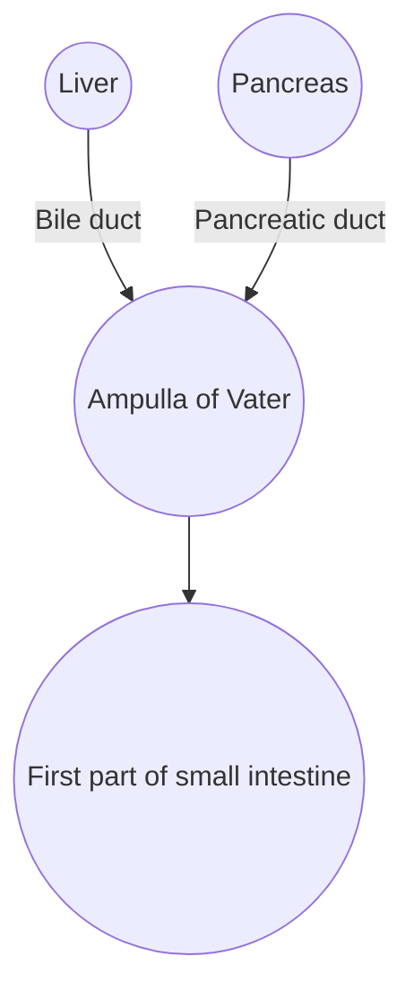

# Ampullary & Duodenal Cancer 101

*A plain-language field guide for families stepping into this diagnosis for the first time.*

## 1. Where it lives (visual)

- The **ampulla** is the “mixing valve” where bile and pancreatic juice empty into the small intestine.
- Tumors here can block bile (causing jaundice) or pancreatic enzymes (causing weight loss).

## 2. Subtype cheat sheet

| Question | Intestinal type | Pancreatobiliary type |
|----------|-----------------|----------------------|
| Looks like | Colon lining (velvet) | Pancreas duct (tough scar) |
| Common chemo | 5-FU/oxaliplatin regimens | FOLFIRINOX, gemcitabine/cisplatin |
| Biomarker perks | MSI-H more common → immunotherapy | KRAS/BRCA patterns → targeted / platinum |

**Analogy:** Intestinal-type = brush fire (slower, responds to garden hose). Pancreatobiliary-type = grease fire (hotter, needs fire extinguisher).

## 3. Symptoms to watch

- Yellow skin/eyes, dark urine, pale stools → bile blockage.
- Itching, fevers with chills → possible cholangitis (ER now).
- Nausea after eating, unexplained weight loss, fatigue.
- Abdominal/back pain that wraps like a belt.

## 4. Testing roadmap

1. Labs: liver panel, bilirubin, CA19-9, CEA.
2. Imaging: CT/MRI pancreas protocol, MRCP for ducts.
3. Endoscopy: EUS/ERCP to biopsy and place stents.
4. Pathology + biomarkers: MSI/MMR, HER2, KRAS, BRCA/PALB2, TMB.

## 5. Treatment building blocks

**Step 1 – Open the pipes:** ERCP stent or external drain so bile flows again.

**Step 2 – Choose systemic therapy:**
- **FOLFIRINOX:** best shrinkage, more side effects.
- **Gemcitabine + Cisplatin (+Durvalumab):** balanced option for many.
- **CAPOX / FOLFOX:** pill + IV mix, often super helpful for intestinal subtype.
- **Capecitabine:** gentle pill for maintenance/frail patients.

**Step 3 – Supportive care:** enzymes, nutrition, nerve blocks, palliative team.

**Optional – Trials/targets:** use biomarkers to chase HER2, KRAS G12C, MSI-H, BRCA, FGFR, NTRK options.

## 6. Daily life playbook

| Situation | Quick action |
|-----------|--------------|
| Drain output drops or turns dark | Flush if instructed, call interventional radiology, monitor fever |
| Pain spikes >6/10 | Follow pain ladder (Tylenol → opioids → ER if uncontrolled) |
| Appetite tanking | Enzyme capsules + high-calorie shakes, dietitian consult |
| Chemo days | Pre-med antiemetics, hydration goal, light walks |
| Sleep/mood | Gratitude journal, counseling/palliative team, melatonin or mirtazapine if prescribed |

## 7. Alternative questions

Curious about ivermectin, fenbendazole, vitamin C, mistletoe, HBOT? Check the [Alternative Toolkit](alternative-toolkit.md) for what’s known, risks, and community links before trying anything.

## 8. Who’s on the care team?

- **Medical oncologist** – leads systemic therapy.
- **Gastroenterologist/IR** – manages stents/drains.
- **Surgeon** – handles Whipple or bypass if possible.
- **Palliative/supportive care** – pain, mood, sleep, caregiver support.
- **Nutrition, PT/OT, social work** – keep strength up.

## 9. Glossary sampler

- **ERCP:** scope that enters bile/pancreatic ducts to place stents.
- **EUS:** ultrasound probe inside stomach/duodenum to visualize and biopsy.
- **Stent:** small tube that props the duct open (plastic = temporary, metal = longer).
- **FOLFIRINOX:** 4-drug chemo (oxaliplatin, irinotecan, leucovorin, 5-FU).
- **MSI-H:** microsatellite instability-high → immune therapy eligible.

## 10. Next steps

- See [Start Here](start-here.md) for 72-hour checklist.
- Use [Practical Playbook](practical-playbook.md) for weekly planning.
- Visit [Real-World Experiences](real-world.md) for caregiver stories.
- Ready for the deep dive? Jump to [Deep Science Map](deep-science.md).
